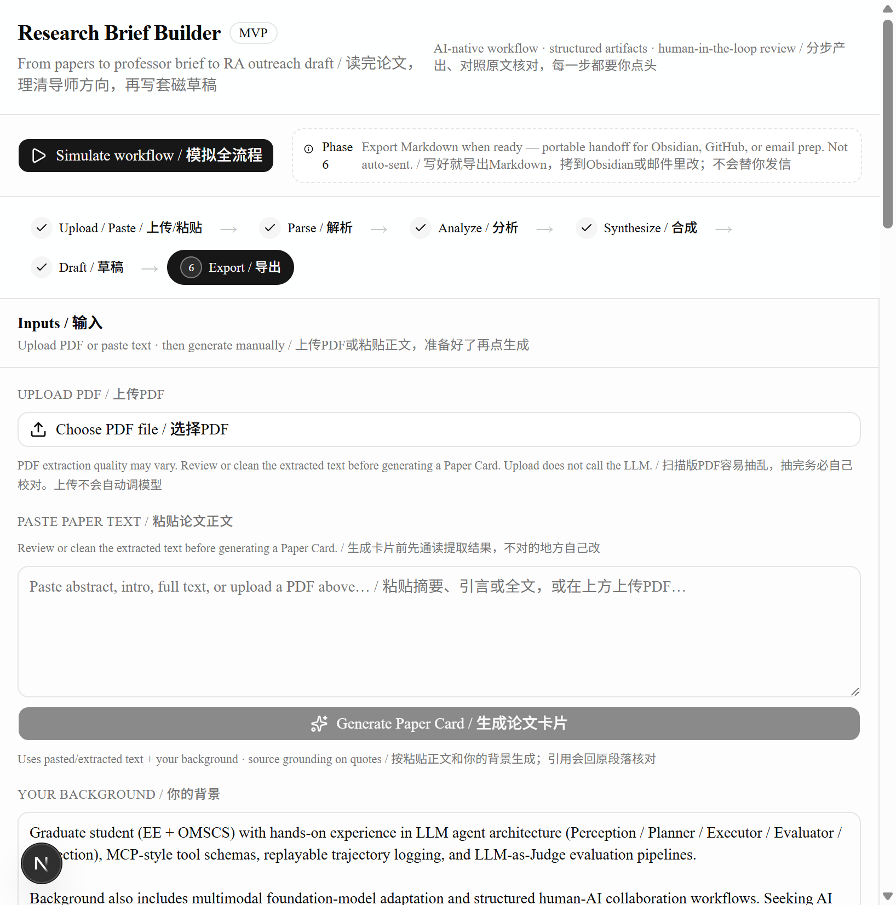
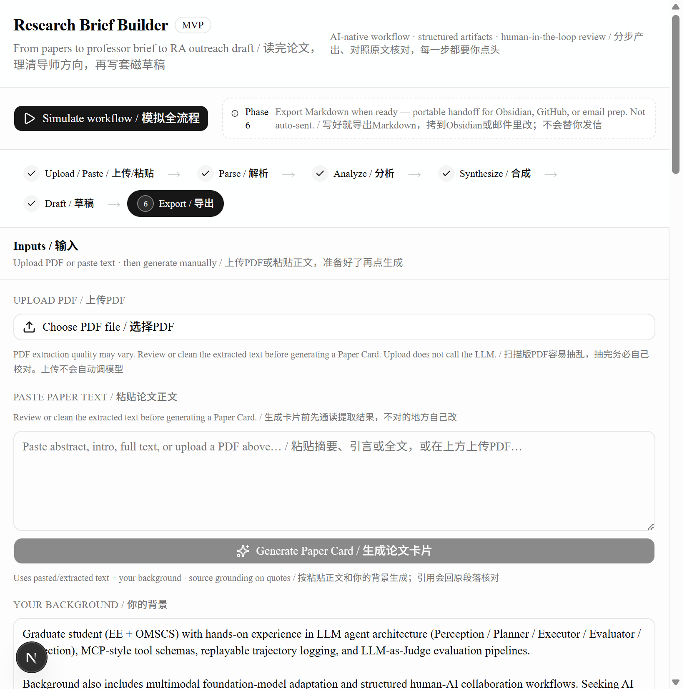
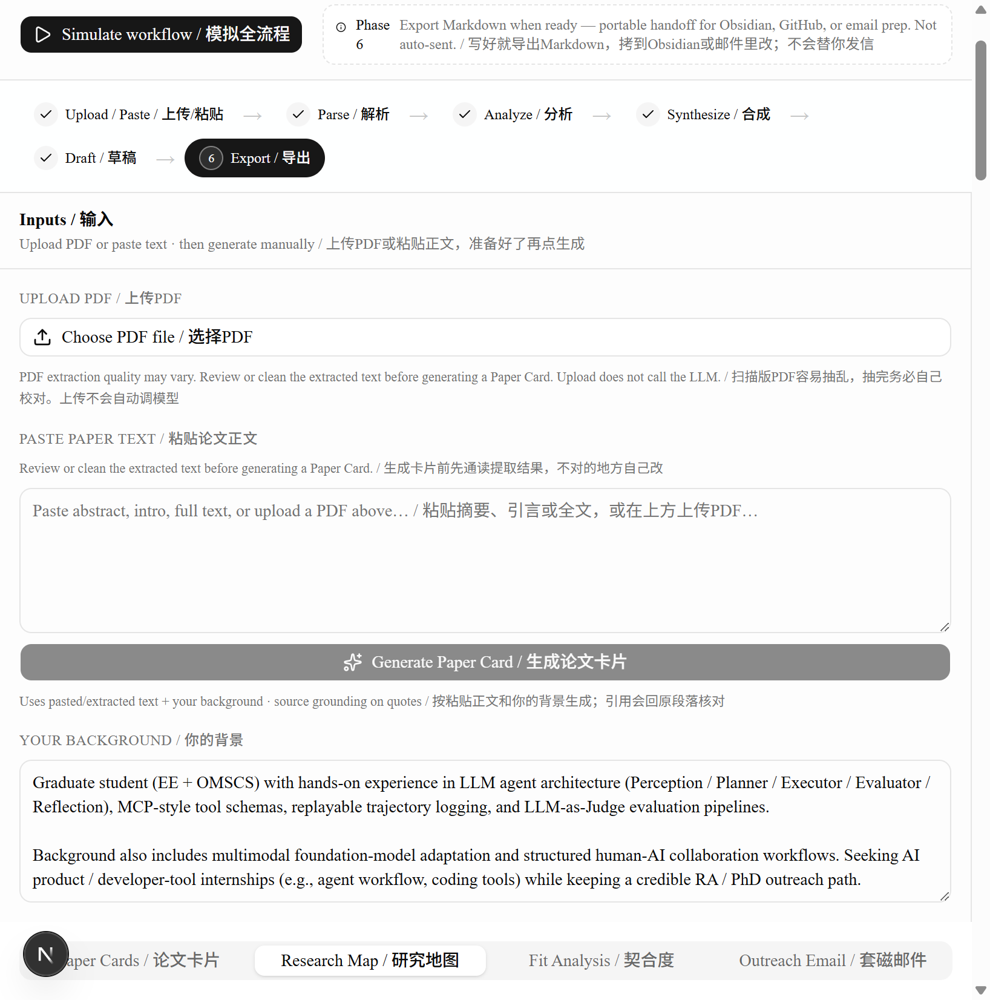
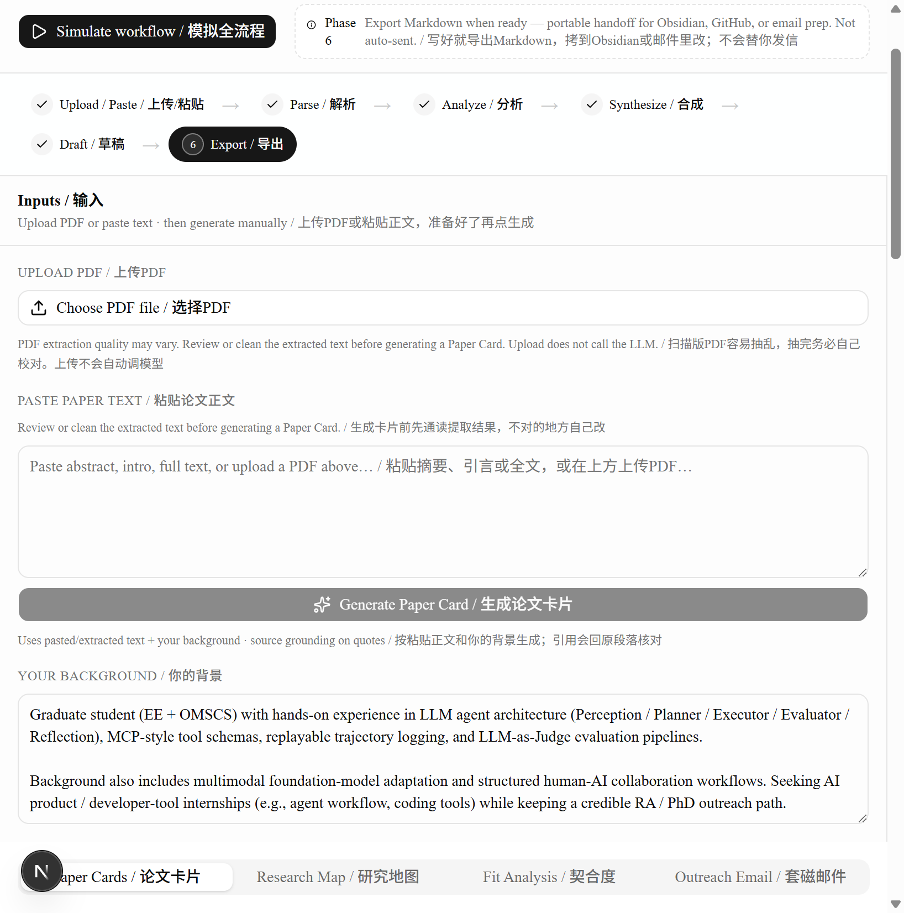
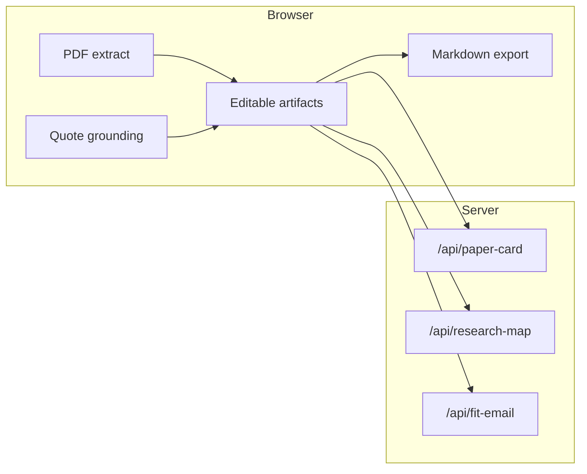

# Research Brief Builder

**AI workflow for RA outreach — staged artifacts, quote grounding, not a chatbot.**

| | |
|---|---|
| **Live demo** | [5-min Vercel setup](docs/VERCEL_ONE_CLICK.md) → paste URL below (Simulate works without API key) |
| **Try in 30s** | **Simulate workflow** → skim tabs → **Export Markdown** (no API key) |
| **For interviewers** | [docs/INTERVIEW.md](docs/INTERVIEW.md) · [Product brief](docs/PRODUCT_BRIEF.md) |
| **Repo** | https://github.com/jiawei-vita-li/research-brief-builder |

```text
Live demo: https://research-brief-builder.vercel.app
```
↑ Replace after Vercel deploy (Dashboard import → env vars → redeploy). **Simulate** works without a key.

---

## Demo

| Step | Screenshot |
|------|------------|
| Simulate + stepper |  |
| Paper card + grounding |  |
| Research map |  |
| Export |  |

<!-- Optional GIF:  -->

If images are missing, run `npm run dev` → http://localhost:3000 → **Simulate workflow** (see [docs/assets/README.md](docs/assets/README.md)).

---

## Architecture



No database · no email send · PDF never uploaded to server.

---

## MVP (Phases 1–6)

| Phase | Feature |
|-------|---------|
| 1 | **Simulate workflow** (mock, no API key) |
| 2 | **Generate Paper Card** (paste + LLM) |
| 2.5 | User background + **source grounding** |
| 3 | **PDF upload** → client extract, review first |
| 4 | **Synthesize Research Map** |
| 5 | **Generate Fit & Email** |
| 6 | **Export Markdown** + **Copy to clipboard** |

**Real LLM path:** paste ≥100 chars → generate card → synthesize map → background ≥80 chars → fit & email.

---

## Run locally

```bash
git clone https://github.com/jiawei-vita-li/research-brief-builder.git
cd research-brief-builder
npm install
cp .env.example .env.local
# Optional for LLM steps: OPENAI_API_KEY=sk-...
npm run dev
```

Open http://localhost:3000

---

## Docs

| Doc | Purpose |
|-----|---------|
| [INTERVIEW.md](docs/INTERVIEW.md) | 30s script, decisions, tradeoffs |
| [PRODUCT_BRIEF.md](docs/PRODUCT_BRIEF.md) | Positioning & differentiation |
| [MVP_SPEC.md](docs/MVP_SPEC.md) | Schemas, APIs, phases |
| [DEPLOYMENT.md](docs/DEPLOYMENT.md) | Vercel + env vars |
| [DEMO_RECORDING.md](docs/DEMO_RECORDING.md) | GIF storyboard |

UI copy: `English / 中文` in [`lib/i18n/strings.ts`](lib/i18n/strings.ts) ([`zhNormalize`](lib/i18n/bi.ts): no spaces around English/digits in 中文).

---

## Scripts

- `npm run dev` — development
- `npm run build` — production build
- `npm run lint` — ESLint

---

## Interview pitch

*Structured, verifiable RA outreach with visible steps and editable artifacts—not a generic summarizer or chat wrapper.*

---

## 中文（简要）

帮研究生做RA套磁的分步AI工作流：论文卡片、研究地图、契合度、邮件草稿均可编辑；引文对照原文；可导出Markdown。

| | |
|---|---|
| **线上演示** | 见 [DEPLOYMENT.md](docs/DEPLOYMENT.md)，部署后替换上方Live demo链接 |
| **30秒体验** | **模拟全流程** → 浏览各页 → **导出Markdown**（无需APIKey） |
| **面试官** | [INTERVIEW.md](docs/INTERVIEW.md) |

**面试一句话：** *按步骤产出、能核对引文、能改能导出，不是聊天套壳。*

<details>
<summary>完整中文说明（展开）</summary>

### 本地运行

```bash
git clone https://github.com/jiawei-vita-li/research-brief-builder.git
cd research-brief-builder
npm install
cp .env.example .env.local
# 可选：OPENAI_API_KEY=sk-...
npm run dev
```

### MVP功能（Phase1–6）

| 阶段 | 功能 |
|------|------|
| 1 | 模拟全流程（无需APIKey） |
| 2 | 生成论文卡片 |
| 2.5 | 个人背景 + 引文对照原文 |
| 3 | PDF上传，客户端抽文本 |
| 4 | 合成研究地图 |
| 5 | 生成契合度与邮件 |
| 6 | 导出Markdown + 复制 |

文档：[产品简介](docs/PRODUCT_BRIEF.md) · [MVP规格](docs/MVP_SPEC.md) · [部署](docs/DEPLOYMENT.md)

</details>

---

## License

[MIT](LICENSE)
